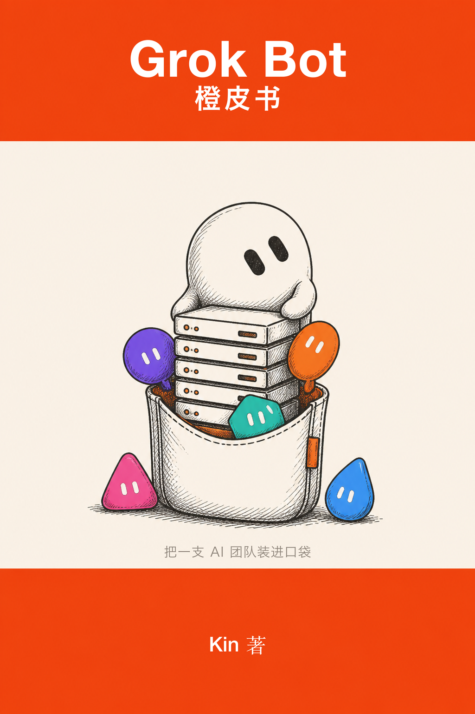

  

# Grok Bot 橙皮书：把一支 AI 团队装进口袋

**从入门到进阶 · 多智能体协作 · Routine · 省钱与自动化**

v260823 · 免费在线阅读 · 全书约 1.6 万字

---

## 这是一本什么书

2026 年 8 月 11 日，xAI 与 Cursor 联合发布了 **Grok Bot**。它跟 Grok 不是一回事——Grok 是聊天机器人，你问它答；**Grok Bot 是一支由多个 AI 组成的工作团队**：每个 Bot 拥有自己的云端电脑，像人一样登录你授权的应用和网站干活，互相发消息、互相交接任务，只在需要你拍板时才回来找你。

AI 第一次真正走进了我们的手机端，而且不是一个，是一群；它们和人一起协作，这是人和 AI 协作的一种全新方式，也是一个非常重要、非常大的方向。

这本书记录了它上线头两周的样子。写作过程中，我们翻阅了大量官方资料和一手报道，把社区里的各种玩法几乎试了个遍，自己也做了大量实测，并在十几个 Global 的 AI 社区里反复交流学习。产品还很新，迭代飞快，书中难免偶尔有幻觉或过时的地方，大家参考着看，动手前多核对一眼官方最新说明。

## 📖 在线阅读

全书免费阅读：**[Grok-Bot-橙皮书.md](./Grok-Bot-橙皮书.md)**

## 15 秒了解 Grok Bot

| | Grok | Grok Bot |
|---|---|---|
| 它是什么 | 聊天助手 | 一支 AI 工作团队 |
| 你怎么用它 | 提问 | 派活 |
| 在哪干活 | 对话框里 | 云端虚拟机里 |
| 关掉手机 | 对话结束 | 它继续上班 |
| 类比 | 一个聪明的实习生 | 一个不用睡觉的部门 |

**订阅门槛速览**（2026 年 8 月下旬）：免费试用 $0（人人可领限量额度）→ Cursor Pro+ $60/月（当前最低付费档）→ SuperGrok Plus $100/月 → Cursor Ultra $200/月 → SuperGrok Heavy $300/月；团队档 Cursor Teams $40/席/月、Teams Premium $120/席/月。

## 全书结构

**序章：这不是又一个聊天机器人**

**Part 1 入门**

- 00 零成本开箱：限量免费试用怎么花在刀刃上
- 01 Grok Bot 到底是什么：三个设计原则（记忆 / 协作 / 学习）
- 02 怎么才能用上：降价后的完整档位表与一句话选型
- 03 开箱第一个任务：大脑倾倒 → 反向配置 → 派第一个真活

**Part 2 进阶**

- 04 多智能体：给团队请一个总监（Chief of Staff 模式与群聊协作）
- 05 一支五人舰队的完整案例：官方 Bug 接力协作案例 + 五张可直接抄的「招募卡」+ 中文环境本土化改造 + 上手节奏
- 06 Routine：示范一遍，它学一辈子（附教学前检查清单）
- 07 工具箱：Agent Mail / Vercel / Tailscale / Last 30 Days / MCP 接入
- 08 Auto-review：它什么时候来找你签字，正确的审批姿势

**Part 3 省钱与自动化**

- 09 额度是怎么烧完的：六个隐形吞金兽自查
- 10 用最低的成本发挥最高的智能：四条心法 + 分层演算表
- 11 无人值守：哨兵型 / 流水线型 / 夜班型，附第一条流水线手把手示例与三道质量保险

**Part 4 收**

- 12 竞争格局：一个新的趋势（Computer Use / Operator / ChatGPT Work / Claude Cowork 全景对照）
- 13 我的判断

**附录**：数字基准表 · 术语黑话对照 · 待定论问题清单 · 高频十问快答

## 你会学到什么

- ✅ 从零开始把 Grok Bot 用起来：领免费额度、跑通第一个「派活 → 交付」闭环
- ✅ 「大脑倾倒 + 逆向配置」：让 AI 替你搭建你的工作台，而不是你学半天配置
- ✅ 可直接抄的五张 Bot 招募卡：CTO / 内容雷达 / 社群管家 / 商务前台 / 增长实验员（职责 + 信息源 + 判断标准 + 汇报格式四件套）
- ✅ Routine 教学法：什么样的活值得教、怎么教、教完怎么验收
- ✅ 省额度实战：为什么有人两天烧完一周额度，有人还有富余——六个吞金兽与分层用法
- ✅ 第一条无人值守流水线的最小样本：一个采集者 + 一个编辑者 + 一个固定触发时间
- ✅ 多智能体组织形态的全景理解：总监、专线、群聊、任务交接背后的逻辑

## 高频问题速答

**一定要付费才能体验吗？** 不用，8 月 21 日之后人人可开限量免费试用（约 7 天期限，以官方为准）。

**手机关机它还干活吗？** 干活，它跑在云端，这是它和本地 agent 最本质的区别之一。

**额度总是不够用怎么办？** 先按第 09 章六个吞金兽自查，再把重复性工作 routine 化，通常能省一半以上。

**中文场景好用吗？** 好使，第 05 章的本土化改造就是为中文内容工作流准备的。

更多十问快答见附录「高频十问」。

## 适合谁读

- 用过 ChatGPT/Claude，想让 AI 真正替自己干活的人
- 已经在用 Grok Bot，但额度总是不够用的重度玩家
- 关注 AI Agent 趋势、想理解「多智能体协作」到底意味着什么的从业者
- 想低成本养一支「不下班的数字团队」的自由职业者与小团队

## 关于时效

本书版本 **v260823**，记录的是 Grok Bot 公开后的第 12 天。这个品类的一切数字——价格、档位、门槛、功能——保质期以周计。书中关键数字均标注了口径与出处，如果你核出来的和书写的不一样，优先信你自己那一次。

**更新记录**

- v260823（2026-08-23）：初版发布。含降价后完整档位表、「00 零成本开箱」章节、五人舰队招募卡与高频十问。

## 相关链接

- 官方公告：x.ai/news/introducing-grok-bot
- 官方 X 账号：x.com/bot
- 问题反馈与勘误：请提 [Issue](../../issues)

## 协议

本作品基于 [CC BY-NC-SA 4.0](http://creativecommons.org/licenses/by-nc-sa/4.0/) 协议发布：保留署名的前提下，可自由分享和改编（非商用）。
